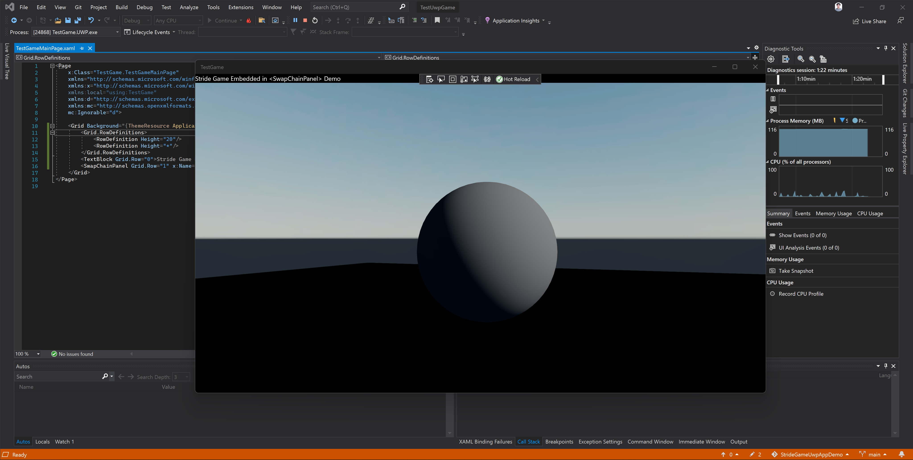

# Stride Game UWP app demo #

This repository demonstrate how to display 3D Game content of [Stride Game Engine](https://stride3d.net/) project to UWP app's [&lt;SwapChainPanel&gt;](https://docs.microsoft.com/en-us/uwp/api/windows.ui.xaml.controls.swapchainpanel):
